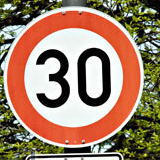
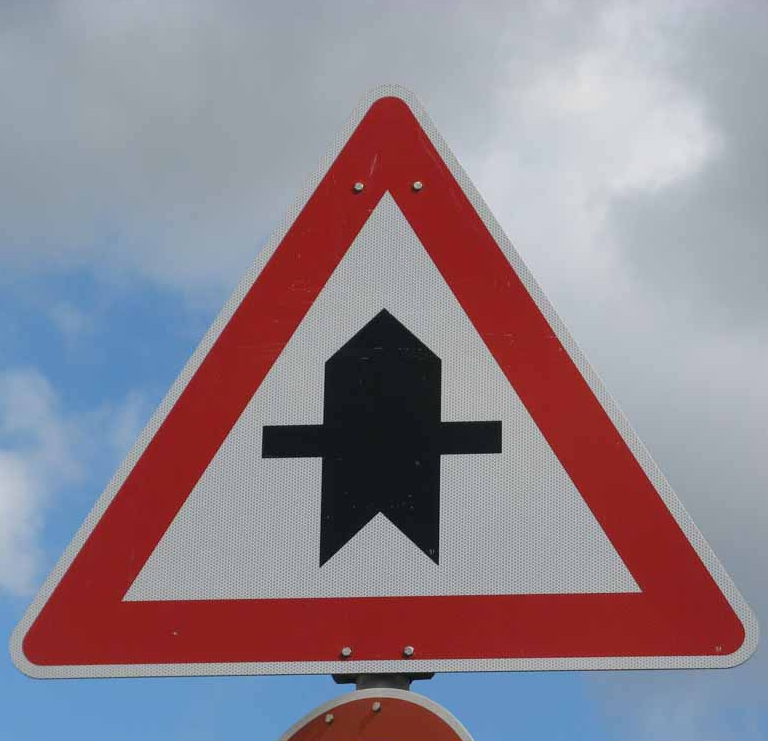
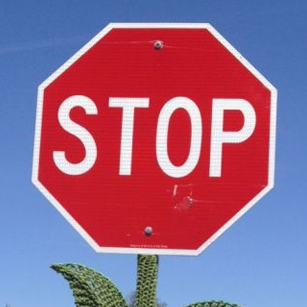
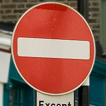
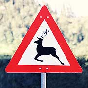

# **Traffic Sign Recognition**

Author: Xie kun

Email:  xiekun2008@gmail.com

---

**Build a Traffic Sign Recognition Project**

The goals / steps of this project are the following:
* Load the data set (see below for links to the project data set)
* Explore, summarize and visualize the data set
* Design, train and test a model architecture
* Use the model to make predictions on new images
* Analyze the softmax probabilities of the new images
* Summarize the results with a written report


[//]: # (Image References)

[image1]: ./images/bar_chart.png "Visualization"
[image11]: ./images/every_traffic_signs.png "every_traffic_signs"
[image2]: ./images/origin_images.png "Origin Images"
[image3]: ./images/pre-processed.png "Pre-processing Images"
[image20]: ./images/featuremap1.png "featuremap Images"

---
## Writeup / README

You're reading it! and here is a link to my [project code](https://github.com/xiekuncn/CarND-Traffic-Sign-Classifier-Project/blob/master/Traffic_Sign_Classifier.ipynb)

### Data Set Summary & Exploration

#### 1. Basic summary of the data set

The code for this step is contained in the second code cell of the IPython notebook.  

I used the numpy library to calculate summary statistics of the traffic signs data set:

* The size of training set is 34799
* The size of test set is 12630
* The shape of a traffic sign image is (32, 32, 3)
* The number of unique classes/labels in the data set is 43

#### 2. Exploratory visualization of the dataset

The code for this step is contained in the third code cell of the IPython notebook.  

Here is an exploratory visualization of the data set. It is a bar chart showing how many samples in different classes.

![alt text][image1]

And I also want to known what the traffic sign looks like, so I plots one sample in every class, and got the following picture.

![alt text][image11]

### Design and Test a Model Architecture

#### 1. Pre-processing and augmented training Data.

The code for this step is contained in the 6th code cell of the
IPython notebook. The 7th code cell show the distorted images
as outputs. This step can help us get a much much more bigger
labeled dataset. I use the following technologies because these
operation will make the new image looks like that capturing from
real world.

* First, I must cast all the inputs as float, because the original data type is 'uint8' at the inputs dataset. and the following operation may much bigger than the uint8's limitation.
* And I change the brightness and contrast randomly.
* And then, I should make sure all the values should between 0 to 255. so the pre-processed images will look like a real image.
* At last, I change the normalized image as following code.
```
float_images = tf.map_fn(
   lambda  img:tf.image.per_image_standardization(img),
   processed_image)
```

Origin Images in training dataset.
![alt text][image2]

The pre-processed images will be using as training dataset.
![alt text][image3]

I only want to add Pre-processing operation for training, so I add a Placeholder named 'is_training', this placeholder will be feeded at training, prediction or evaluation step.


#### 2. Model architecture

The code for my final model is located in the 5th cell of the ipython notebook.

My final model consisted of the following layers:

| Layer         		|     Description	        					|
|:---------------------:|:---------------------------------------------:|
| Input         		| 32x32x3 RGB image   							|
| Convolution 5x5     	| 1x1 stride, VALID padding, outputs 28x28x6 	|
| RELU					|												|
| Max pooling	      	| 2x2 stride,  outputs 14x14x6 |
| Convolution 5x5	    | 1x1 stride, VALID padding, outputs 10x10x16     									|
| RELU					|												|
| Max pooling	      	| 2x2 stride,  outputs 5x5x16 				|
| flatten     	| Input = 5x5x16. Output = 400.|
| Fully connected	1	|  Input = 400. Output = 120.|
| Fully connected	2	|  Input = 120. Output = 84.|
| Fully connected	3	|  Input = 84. Output = 43.|
| Softmax				|         									|
|	loss_operation | reduce mean softmax	|

As we talked before, there are a pre-procesing layer only for training steps which determined by feed_dict "is_training".

#### 3. Train and Test the Model

The 8th code cell of the IPython notebook contains the code for the Training step.

The max EPOCHS is 500, batch size is 128 and the learning rate is 0.001. And I use the AdamOptimizer optimizer.

The training will be finished when the accuracy is bigger than 0.94.

The code for calculating the accuracy of the model is located in the ninth and tenth cell of the Ipython notebook.

My final model results were:
* training set accuracy of 0.9996551625046697
* validation set accuracy of 0.9410430839272583
* test set accuracy of 0.9294536814459334

The typical LeNet was chosen, because
* The mission is very classical
* I found this [paper](http://www.people.usi.ch/mascij/data/papers/2011_ijcnn_committee.pdf) which got first place at GTSDB using the CNN also.
* The accuracy at validation and testing data set is nearly same, it means our model is not over fitting and works fine.

And I also change the accuracy for quiting training to 0.95/0.96
 and using the different learning rate, the testing accuracy is
  also near 0.93. and During training, the accuracy is really
   hart to raise when the accuracy is above 0.94.

The 0.94 maybe the capacity of LeNet for GTSDB mission.

### Test a Model on New Images

Here are five German traffic signs that I found on the web:








These images have different image size and the different ROI.

#### 1. Test result.

The code for making predictions on my final model is located in the tenth cell of the Ipython notebook.

Here are the results of the prediction:

| Image			        |     Prediction	        					|
|:---------------------:|:---------------------------------------------:|
| Speed limit(30km/h)    | Speed limit(30km/h)   									|
| Right-of-way at next intersection | Right-of-way at next intersection |
| Wild animals crossing	 | Wild animals crossing |
| Stop	      		       | Stop |
| No Entry			         | No Entry |


The model was able to correctly guess 5 of the 5 traffic signs, which gives an accuracy of 100%.

#### 2. The softmax for Prediction result

The code for making predictions on my final model is located in the 13th cell of the Ipython notebook.

For the first image, the model is relatively sure that this is a Speed limit sign(Probability is almost 100%). And we also can found that the following results is really similar with Label 1, 3 of them are Speed limit sign but the different speed.


|Indice	|Probability	|Sign name|
|:---------------------:|:---------------------------------------------:|:---------------------:|
|1	 |1.0000e+00|	 Speed limit (30km/h)|
|2	 |6.8785e-07|	 Speed limit (50km/h)|
|5	 |2.9000e-15|	 Speed limit (80km/h)|
|31	 |1.8731e-18|	 Wild animals crossing|
|0	 |1.2463e-18|	 Speed limit (20km/h)|


For the second image.

|Indice	|Probability	|Sign name|
|:---------------------:|:---------------------------------------------:|:---------------------:|
|11	 |1.0000e+00|	 Right-of-way at the next intersection|
|30	 |3.0205e-07|	 Beware of ice/snow|
|24	 |9.2838e-14|	 Road narrows on the right|
|7	 |6.1428e-14|	 Speed limit (100km/h)|
|28	 |2.9280e-17|	 Children crossing|

For the third image.

|Indice	|Probability	|Sign name|
|:---------------------:|:---------------------------------------------:|:---------------------:|
|31	 |9.9686e-01|	 Wild animals crossing|
|21	 |3.1151e-03|	 Double curve|
|11	 |2.8650e-05|	 Right-of-way at the next intersection|
|7	 |3.0583e-07|	 Speed limit (100km/h)|
|23	| 9.8158e-08|	 Slippery road|

For the fourth image.

|Indice	|Probability	|Sign name|
|:---------------------:|:---------------------------------------------:|:---------------------:|
|14	 |1.0000e+00 |	 Stop|
|17	 |3.9659e-10	| No entry|
|1	 |5.2380e-11	| Speed limit (30km/h)|
|3	 |5.7950e-13	| Speed limit (60km/h)|
|32	 |9.8081e-14	| End of all speed and passing limits|


For the last image.

|Indice	|Probability	|Sign name|
|:---------------------:|:---------------------------------------------:|:---------------------:|
|17	 |1.0000e+00|	 No entry|
|14	 |5.0014e-08|	 Stop|
|1	 |3.8167e-11|	 Speed limit (30km/h)|
|15	 |2.7269e-11|	 No vehicles|
|9	 |9.8988e-12|	 No passing|


#### 4. Visualize the Neural Network's State with Test Images¶

The code for making predictions on my final model is located in the 15th cell of the Ipython notebook.

The following image show the first test image's Feature Map at firt Convolution Layer.

The first test image is


And the Featrue map is

![alt text][image20]

And this image can show us, the model's first layer is sensitive to the sharp of the traffic sign.

We can found a circle at the every feature map, and we also can
 recognize the **number 30** at FeatureMap 0, and **number 50**
 at FeatureMap 5. The softmax result for the first image tell us
  the same thing, the '30km/h speed limit' and '50km/h speed
  limit' got more probability at last.
